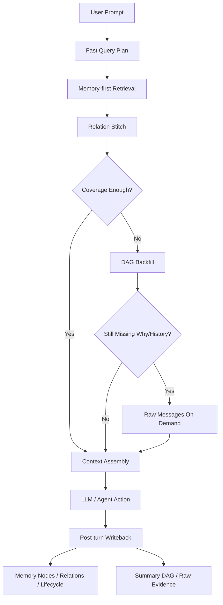

# Memory-first Retrieval Architecture

> Chinese version: [MEMORY_FIRST_RETRIEVAL_ARCHITECTURE.zh-CN.md](./MEMORY_FIRST_RETRIEVAL_ARCHITECTURE.zh-CN.md)
>
> This document is the formal design note for the current retrieval backbone. For the lifecycle state machine and update rules, see [MEMORY_NODE_LIFECYCLE.md](./MEMORY_NODE_LIFECYCLE.md). For the more operational retrieval guide, see [MEMORY_RETRIEVAL_REFERENCE.md](./MEMORY_RETRIEVAL_REFERENCE.md).

## 1. Project positioning

The core goal of CodeMemory is not merely to compress context. It is to preserve engineering continuity for a coding agent across long sessions, complex refactors, and repeated debugging loops:

- long-session coding: avoid re-explaining requirements after context truncation
- complex refactors: preserve prior decisions, rejected alternatives, and the current target
- multi-round debugging: remember failures, fix attempts, validation results, and reopen paths

The right positioning is therefore:

```text
A memory-first engineering memory system.
Memory Nodes provide primary recall,
Relations rebuild short reasoning chains,
the Summary DAG backfills evidence,
and Raw Messages are replayed only on demand.
```

## 2. Core flow

The main chain is:

```text
Memory-first + Relation stitch + DAG backfill + Raw on demand
```

Concretely:

1. `Memory-first`  
   Recall high-value memory nodes before scanning raw history.

2. `Relation stitch`  
   Expand isolated recalls into short chains that restore how a task evolved and why.

3. `DAG backfill`  
   Bring back summary DAG evidence when nodes alone cannot explain rationale, timeline, or conflicts.

4. `Raw on demand`  
   Expand raw messages only when evidence is still insufficient.

## 3. Layered responsibilities

### 3.1 Memory Nodes: primary index layer

Current first-class node kinds:

- `task`
- `constraint`
- `decision`
- `failure`
- `fix_attempt`
- `summary`

This layer answers:

- What are we currently trying to do?
- Which constraints must still hold?
- What has already been decided?
- Which error has already happened?
- Which repair path has already been tried?

### 3.2 Relations: chain layer

Current relation types that matter for short-chain reconstruction:

- `supersedes`
- `resolves`
- `attemptedFixFor`
- `causedBy`
- `conflictsWith`
- `derivedFromSummary`
- `relatedTo`

This layer turns point recall into chain recall.

### 3.3 Summary DAG: evidence and backfill layer

The Summary DAG is no longer the main recall surface. Its role is:

- historical compression
- evidence backfill
- timeline recovery
- replay of longer context spans

### 3.4 Raw messages: final fact layer

Raw messages should only be expanded when:

- the original user wording is needed
- the complete error or tool output is needed
- the underlying evidence of a summary must be inspected

## 4. Prompt retrieval sequence



## 5. Default recall rules in the current stage

### 5.1 Query plan

`createFastRetrievalPlan` first performs a local fast plan:

- extract `files`, `commands`, `symbols`, and `topics`
- infer `intent` and `riskLevel`
- generate `wantedKinds`
- generate `tagQueries` and `queryVariants`

By default, `task` and `constraint` should always be included in `wantedKinds`, because:

- they are the primary context for "continue the next step" prompts
- they directly support the goal of not re-explaining requirements
- even without strong anchors, they can be recalled through `kind:*` and conversation priority

### 5.2 Memory-first

Recommended default recall order:

1. `task`
2. `constraint`
3. `failure`
4. `decision`
5. `fix_attempt`
6. `summary`

This does not mean summaries are unimportant. It means summaries behave more like evidence anchors and should not outrank the currently valid engineering state.

### 5.3 DAG backfill trigger conditions

Backfill the DAG only when:

- rationale is missing
- the origin of a requirement is missing
- the timeline needs to be recovered
- multiple nodes conflict
- recall score or coverage is weak

## 6. Why not DAG-first

If the DAG is made primary, the system becomes better at:

- replaying history
- compressing long text
- retaining evidence

But it becomes worse at:

- expressing the currently valid state
- updating failure and fix-attempt lifecycle state
- representing supersede, resolve, and reopen transitions
- quickly surfacing the current task and constraints

Given the product goals, the better model is:

```text
Node-led engineering-state memory
+ relation stitching
+ DAG evidence backfill
```

## 7. Current implementation boundaries

At this stage, eight things are already in place:

1. `task` and `constraint` are first-class memory nodes
2. prompt retrieval prioritizes `task` and `constraint` by default
3. explicit write tools exist so the model can persist key tasks and constraints intentionally
4. relation stitch is integrated into prompt retrieval with controlled two-hop short-chain backfill
5. relation stitch is filtered by prompt intent through whitelists and templates, reducing cross-contamination between debugging chains and rationale chains
6. `task` and `constraint` support explicit supersede plus lifecycle admin resolve and supersede updates
7. the relation-stitch hot path uses batched relation queries instead of N+1 expansion per node
8. `retrieveForPrompt` already emits structured retrieval metrics for debugging and production observation

Future improvements:

- short-chain assembly like `task -> decision -> fix_attempt -> failure -> resolution`
- automatic extraction of `task` and `constraint` from high-confidence user and assistant turns
- stale heuristics and auto-convergence rules for `task` and `constraint`
- long-term sampling, aggregation, and false-recall analysis for retrieval metrics
