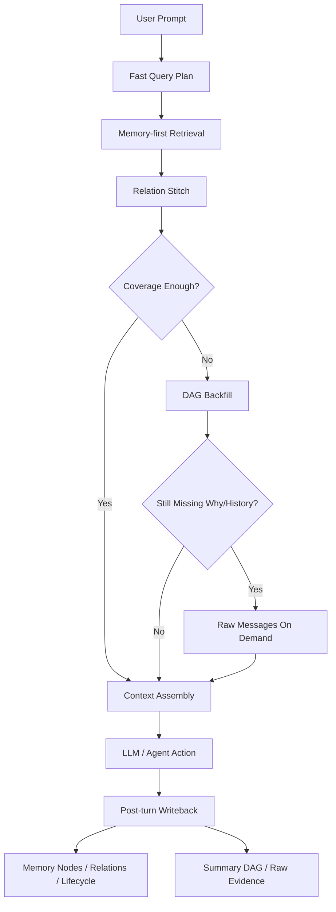

# Memory-first 检索架构

> 本文是当前检索主链的正式设计说明。配套状态机与更新规则见 [MEMORY_NODE_LIFECYCLE.md](./MEMORY_NODE_LIFECYCLE.md)，更偏操作层的检索说明见 [MEMORY_RETRIEVAL_REFERENCE.md](./MEMORY_RETRIEVAL_REFERENCE.md)。

## 1. 项目定位

CodeMemory 的核心目标不是单纯压缩上下文，而是让 coding agent 在长会话、复杂重构和多轮调试里保持工程连续性：

- 长会话 coding：避免上下文截断后反复解释需求。
- 复杂重构：完整保留之前的设计决策、放弃过的方案和当前目标。
- 多轮调试：记住失败、修复尝试、验证结果和 reopen 链路，避免重复踩坑。

因此，系统的正式定位应是：

```text
Memory-first 的工程记忆系统。
Memory Node 负责主召回，Relation 负责拼链，
Summary DAG 负责证据回填，Raw Messages 负责按需回放。
```

## 2. 核心流程

系统采用下面这条主链：

```text
Memory-first + Relation stitch + DAG backfill + Raw on demand
```

具体含义：

1. `Memory-first`
   先召回高价值 Memory Node，而不是先扫描历史消息。

2. `Relation stitch`
   把单点记忆沿 relation 扩成短链，恢复“之前是什么、为什么、要做成什么”的演化关系。

3. `DAG backfill`
   当 node 不足以解释原因、时间线或冲突时，再回填 summary DAG。

4. `Raw on demand`
   只有证据仍然不足时，才展开原始 message。

## 3. 分层职责

### 3.1 Memory Node：主索引层

当前一等 node：

- `task`
- `constraint`
- `decision`
- `failure`
- `fix_attempt`
- `summary`

这层负责回答：

- 当前到底要做什么
- 哪些约束必须保持
- 之前决定了什么
- 哪个错误踩过
- 哪个修法试过

### 3.2 Relation：链路层

当前 relation 负责把 node 拼成短链：

- `supersedes`
- `resolves`
- `attemptedFixFor`
- `causedBy`
- `conflictsWith`
- `derivedFromSummary`
- `relatedTo`

这层负责把“点召回”变成“链路召回”。

### 3.3 Summary DAG：证据与回填层

Summary DAG 不再承担主召回职责，而承担：

- 历史压缩
- 证据回填
- 时间线恢复
- 长段上下文回放

### 3.4 Raw Messages：最终事实层

原始消息只在以下情况展开：

- 需要恢复用户原话
- 需要看完整报错 / tool 输出
- 需要追溯某个 summary 的底层证据

## 4. Prompt 检索时序



## 5. 当前阶段的默认召回规则

### 5.1 Query plan

当前 `createFastRetrievalPlan` 先做本地快速规划：

- 抽 `files / commands / symbols / topics`
- 推断 `intent / riskLevel`
- 生成 `wantedKinds`
- 生成 `tagQueries / queryVariants`

默认上，`task` 和 `constraint` 应始终进入 `wantedKinds`，因为：

- 它们是“继续下一步”这类 prompt 的主上下文
- 它们能承接“避免重复解释需求”的核心目标
- 即使 prompt 缺少强 anchor，也可以靠 `kind:*` 和会话优先级召回当前目标

### 5.2 Memory-first

当前建议的优先召回顺序：

1. `task`
2. `constraint`
3. `failure`
4. `decision`
5. `fix_attempt`
6. `summary`

这不是说 summary 不重要，而是 summary 更偏证据锚点，不应压过当前有效工程状态。

### 5.3 DAG backfill 触发条件

以下情况才进入 DAG 回填：

- 缺少 rationale
- 缺少需求来源
- 需要恢复时间线
- 多个 node 冲突
- 召回分数弱或覆盖不够

## 6. 为什么不是 DAG-first

如果以 DAG 为主，系统更擅长：

- 回放历史
- 压缩长文本
- 保留上下文证据

但它不够擅长：

- 表达当前有效状态
- 更新 failure / fix_attempt 生命周期
- 表达 supersede / resolve / reopen
- 在“继续下一步”时快速给出当前任务与约束

所以从项目定位出发，最合适的方案不是 DAG-first，而是：

```text
Node 主导的工程状态记忆 + Relation 拼链 + DAG 证据回填
```

## 7. 当前落地边界

当前阶段已经落八件事：

1. `task / constraint` 进入一等 Memory Node
2. prompt 检索主链默认优先召回 `task / constraint`
3. 提供显式写入工具，让模型在关键 turn 主动固化任务和约束
4. relation stitch 已接入 prompt retrieval，当前支持可控两跳短链回填
5. relation stitch 已按 prompt intent 做 whitelist / template 裁剪，减少调试链路和理由链路互相污染
6. `task / constraint` 已支持显式 supersede，以及 lifecycle admin 的 resolve / supersede 更新
7. relation stitch 热路径已改为批量 relation 查询，避免按节点逐个扩展的 N+1
8. `retrieveForPrompt` 已输出结构化 retrieval metrics，方便线上观测和调试召回质量

后续增强方向：

- `task -> decision -> fix_attempt -> failure -> resolution` 短链拼装
- 自动从高置信 user / assistant turn 提取 task / constraint
- task / constraint 的 stale 启发式和自动收敛规则
- retrieval metrics 的长期采样、聚合和误召回分析
