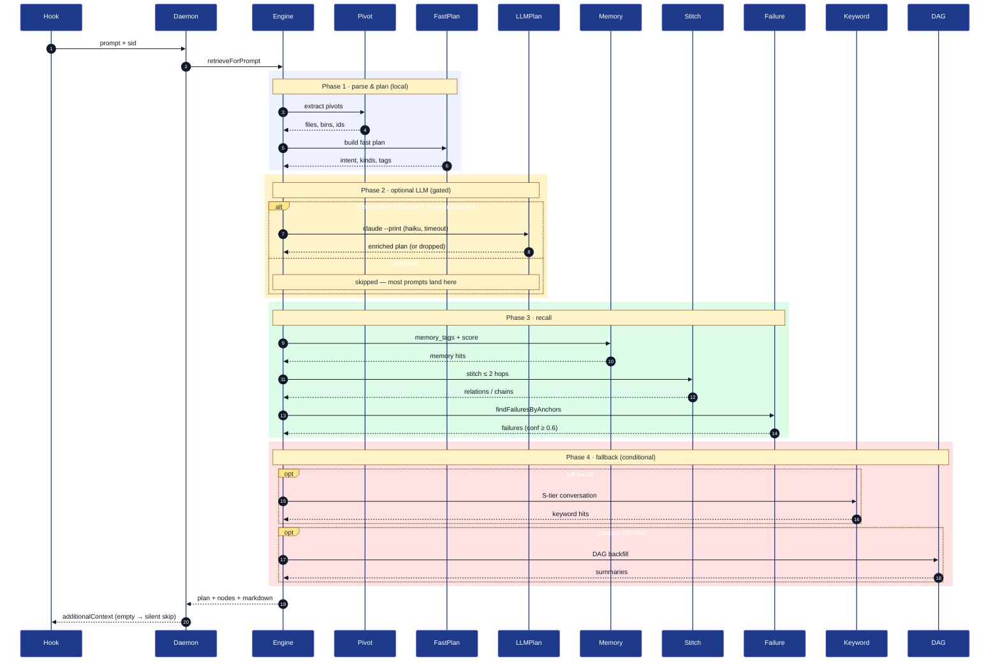

# Memory Retrieval Reference

> Chinese version: [MEMORY_RETRIEVAL_REFERENCE.zh-CN.md](./MEMORY_RETRIEVAL_REFERENCE.zh-CN.md)
>
> This document is the operational reference for the current retrieval path. For formal positioning and architecture boundaries, see [MEMORY_FIRST_RETRIEVAL_ARCHITECTURE.md](./MEMORY_FIRST_RETRIEVAL_ARCHITECTURE.md). For lifecycle rules, see [MEMORY_NODE_LIFECYCLE.md](./MEMORY_NODE_LIFECYCLE.md).

## 1. Current retrieval chain

```text
User prompt
  -> fast pivots
  -> fast retrieval plan
  -> Memory-first retrieval
  -> relation stitch
  -> (optional) smart planner
  -> DAG backfill
  -> raw evidence on demand
  -> markdown injection + metrics
```

### 1.1 Sequence diagram



Participant aliases:

| Alias    | Component                                |
| -------- | ---------------------------------------- |
| Hook     | `hooks/scripts/user-prompt-submit.sh`    |
| Daemon   | `/retrieval/onPrompt` route on daemon    |
| Engine   | `RetrievalEngine.retrieveForPrompt`      |
| Pivot    | `PivotExtractor`                         |
| FastPlan | `FastPlanner` (deterministic, no model)  |
| LLMPlan  | LLM Query Planner (gated, haiku)         |
| Memory   | `MemoryNodeStore` + scorer               |
| Stitch   | Relation stitcher (≤ 2 hops)             |
| Failure  | `findFailuresByAnchors`                  |
| Keyword  | Path B keyword fallback over S-tier      |
| DAG      | Summary DAG backfill                     |

The only step that may invoke a model is Phase 2 — gated by `CODEMEMORY_QUERY_PLANNER_ENABLED` plus the weakness/historical-intent check. Every other step is local SQLite + deterministic scoring.

## 2. Prompt parsing and query planning

### 2.1 Fast plan

Every prompt first goes through a deterministic fast plan:

- extract file paths
- extract commands
- extract symbols
- extract topics
- infer `intent`, `wantedKinds`, `queryVariants`, and `tagQueries`

This step is fully local and does not require a model call.

### 2.2 Smart planner

The smart planner only runs when:

- fast retrieval is weak, and
- the prompt is clearly asking about history, rationale, decisions, or previous failures, or
- the prompt is abstract and contains topics but no strong anchors

In other words, the current query planner is gated. It is not an extra model round for every prompt.

## 3. Memory-first retrieval

Primary retrieval targets currently include:

- `task`
- `constraint`
- `decision`
- `failure`
- `fix_attempt`
- `summary`
- `rationale`

The ranking goal is not "recover all history." It is "recover the engineering state most useful for the next step."

## 4. Relation stitch

Relation stitch is not unbounded graph traversal. It is:

- seeded from primary memory hits
- expanded through controlled one-hop or two-hop traversal
- filtered by whitelist and templates based on prompt intent

Typical chains include:

- `task -> decision`
- `task -> fix_attempt -> failure`
- `decision -> supersedes -> older decision`
- `fix_attempt -> resolves -> failure`

## 5. DAG backfill

The summary DAG is not the primary recall layer. Its current role is:

- evidence layer
- compression layer
- timeline backfill layer
- support when the user asks "why"

The DAG is only consulted when memory-first retrieval plus relation stitch still do not explain enough.

## 6. Raw on demand

Raw message expansion is only worth triggering in cases like:

- the original user wording is needed
- the original failure log needs to be restored
- the DAG still cannot explain the current conflict
- the user is explicitly doing audit or trace-back work

## 7. Return shape

The current `/retrieval/onPrompt` response includes important fields such as:

- `plan`
- `planner`
- `memoryNodes`
- `stitchedRelations`
- `stitchedChains`
- `metrics`
- `counts`

`metrics` is already useful for debugging, but there is not yet a full long-term aggregation and offline evaluation pipeline around it.

## 8. Current boundaries

The retrieval chain is stable, but a few boundaries still matter:

1. Invalid summary IDs can still show up as empty expansion results in some paths instead of explicit errors.
2. Automatic extraction for `task` and `constraint` is not the primary path yet; the system still relies more on explicit writes.
3. Debug-only tools still exist, but the default product surface has already been narrowed down.
