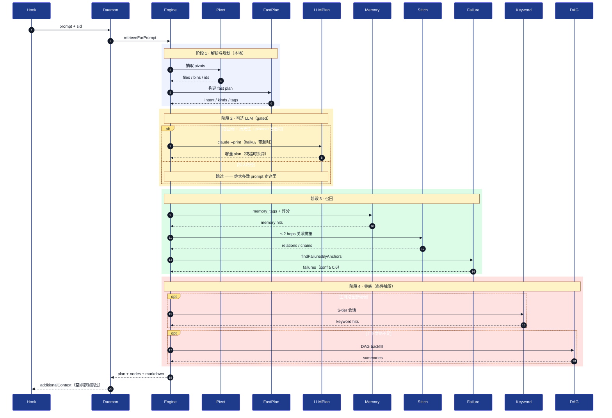

# Memory Retrieval Reference

> English version: [MEMORY_RETRIEVAL_REFERENCE.md](./MEMORY_RETRIEVAL_REFERENCE.md)

> 本文是当前检索链路的操作性参考文档。正式定位与边界见 [MEMORY_FIRST_RETRIEVAL_ARCHITECTURE.zh-CN.md](./MEMORY_FIRST_RETRIEVAL_ARCHITECTURE.zh-CN.md)，生命周期规则见 [MEMORY_NODE_LIFECYCLE.zh-CN.md](./MEMORY_NODE_LIFECYCLE.zh-CN.md)。

## 1. 当前检索主链

```text
User prompt
  -> fast pivots
  -> fast retrieval plan
  -> Memory-first retrieval
  -> relation stitch
  -> (optional) smart planner
  -> DAG backfill
  -> raw evidence on demand
  -> markdown injection + metrics
```

### 1.1 时序图



名称对照表：

| 别名     | 组件                                          |
| -------- | --------------------------------------------- |
| Hook     | `hooks/scripts/user-prompt-submit.sh`         |
| Daemon   | daemon 上的 `/retrieval/onPrompt` 路由        |
| Engine   | `RetrievalEngine.retrieveForPrompt`           |
| Pivot    | `PivotExtractor`                              |
| FastPlan | `FastPlanner`（确定性，不调模型）             |
| LLMPlan  | LLM Query Planner（gated，haiku）             |
| Memory   | `MemoryNodeStore` + scorer                    |
| Stitch   | 关系拼接器（≤ 2 hops）                        |
| Failure  | `findFailuresByAnchors`                       |
| Keyword  | Path B：S-tier 会话 keyword 兜底              |
| DAG      | Summary DAG backfill                          |

整条链路里**唯一**可能调模型的就是阶段 2 —— 受 `CODEMEMORY_QUERY_PLANNER_ENABLED` 加「召回弱 + 历史性 prompt」双重 gate 控制。其余步骤都是本地 SQLite + 确定性评分。

## 2. Prompt parse 与 query planning

### 2.1 Fast plan

每个 prompt 都先走 deterministic fast plan：

- 抽文件路径
- 抽命令
- 抽 symbol
- 抽 topics
- 推断 intent / wantedKinds / queryVariants / tagQueries

这一步完全本地执行，不需要再和模型交互。

### 2.2 Smart planner

只有满足下面条件时，才会尝试 smart planner：

- fast retrieval 命中很弱，且
- prompt 明显在问历史、原因、决策、之前踩坑，或者
- prompt 很抽象但有 topic 没有强 anchor

换句话说，当前 query planner 不是“每次 prompt 都多打一轮模型”，而是一个 gated planner。

## 3. Memory-first retrieval

当前主召回对象包括：

- `task`
- `constraint`
- `decision`
- `failure`
- `fix_attempt`
- `summary`
- `rationale`

当前排序目标不是“把所有历史都找回来”，而是优先找当前继续工作最需要的工程状态。

## 4. Relation stitch

relation stitch 不是通用无界图遍历，而是：

- 先从 primary memory hits 出发
- 做受控的一跳 / 两跳扩展
- 按 prompt intent 做 whitelist / template 裁剪

典型链路包括：

- `task -> decision`
- `task -> fix_attempt -> failure`
- `decision -> supersedes -> older decision`
- `fix_attempt -> resolves -> failure`

## 5. DAG backfill

summary DAG 当前的角色不是主召回层，而是：

- 证据层
- 压缩层
- 时间线回填层
- 需要追问“为什么”时的补充层

只有当 Memory-first + stitch 还不够时，才回填 DAG。

## 6. Raw on demand

raw message expansion 只在下面几类场景才值得触发：

- 需要用户原始约束原话
- 需要还原失败日志原文
- DAG 仍然解释不清当前冲突
- 明确在做审计/追溯

## 7. 返回结果

当前 `/retrieval/onPrompt` 返回的结构里，重要字段包括：

- `plan`
- `planner`
- `memoryNodes`
- `stitchedRelations`
- `stitchedChains`
- `metrics`
- `counts`

其中 `metrics` 目前已经可用于调试，但还没有长期聚合和离线评测体系。

## 8. 当前边界

当前检索链路已经稳定，但仍有几个边界要明确：

1. invalid summary id 在 expansion 某些路径里仍可能表现为空结果，而不是显式错误。
2. `task / constraint` 自动提取还不是主路径，当前更依赖显式写入。
3. debug-only 工具仍存在，但默认产品表面已经尽量收缩。
